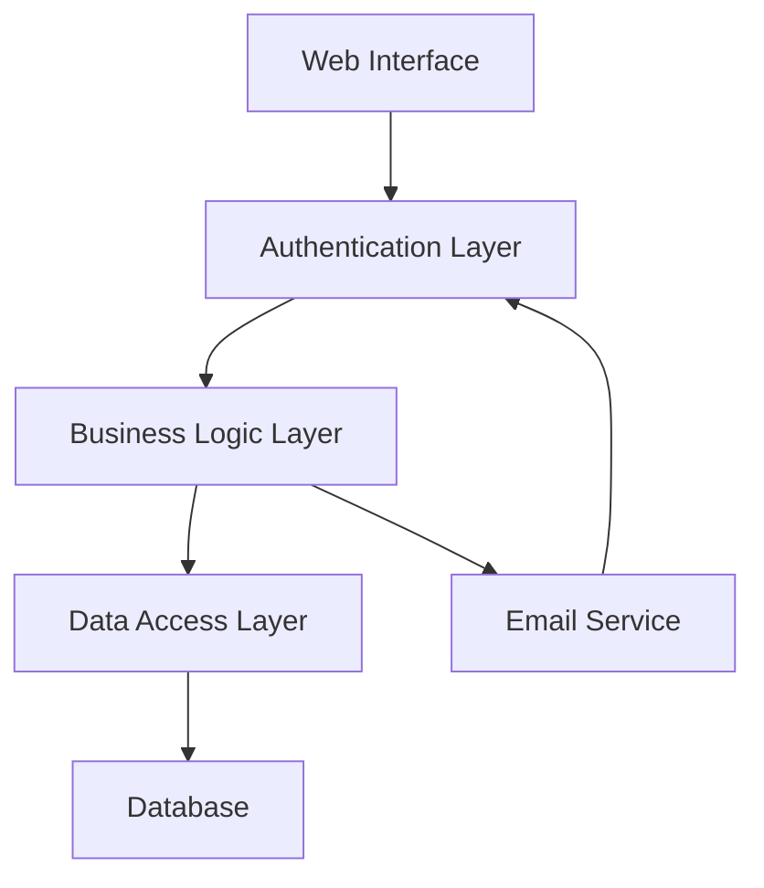
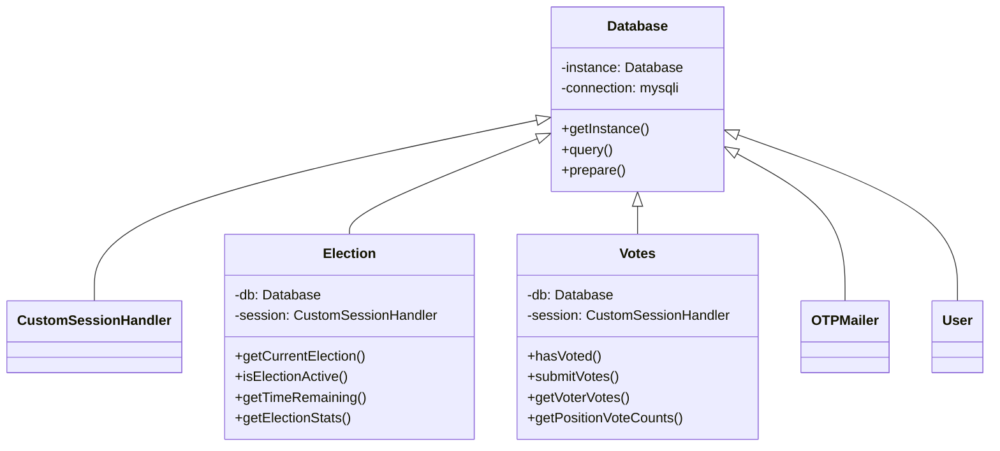
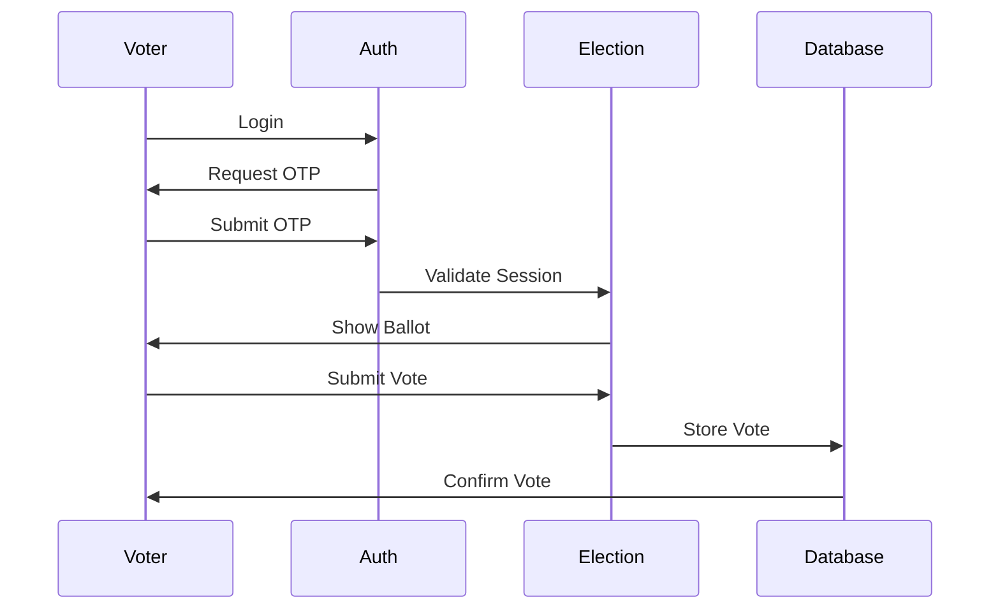
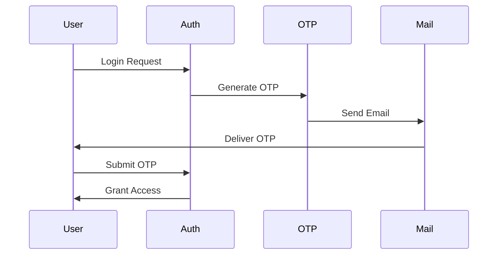
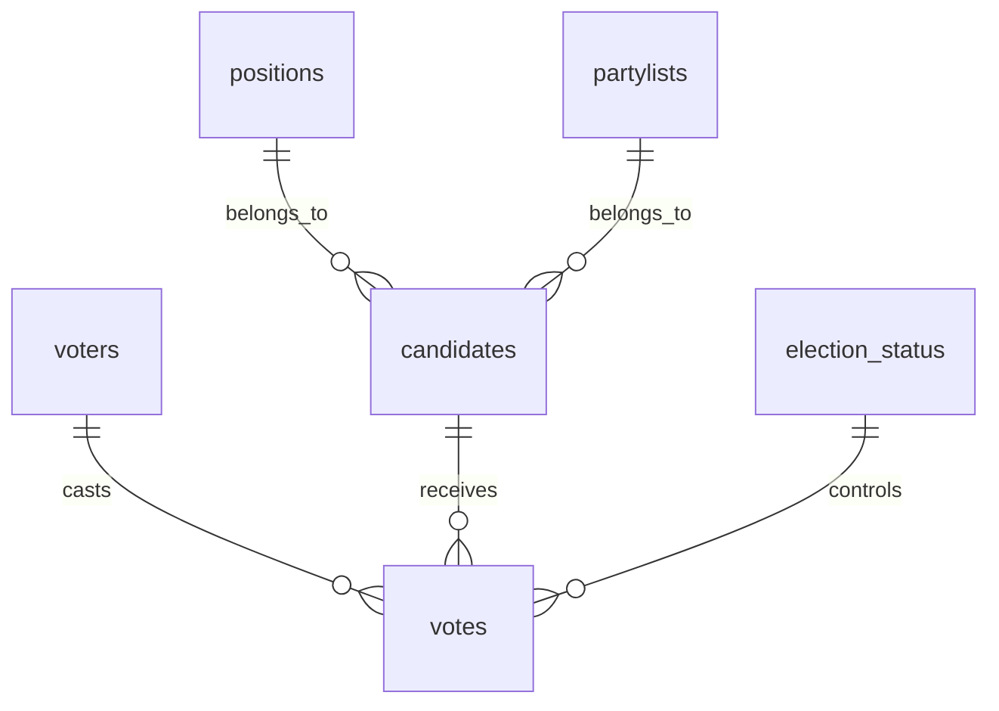
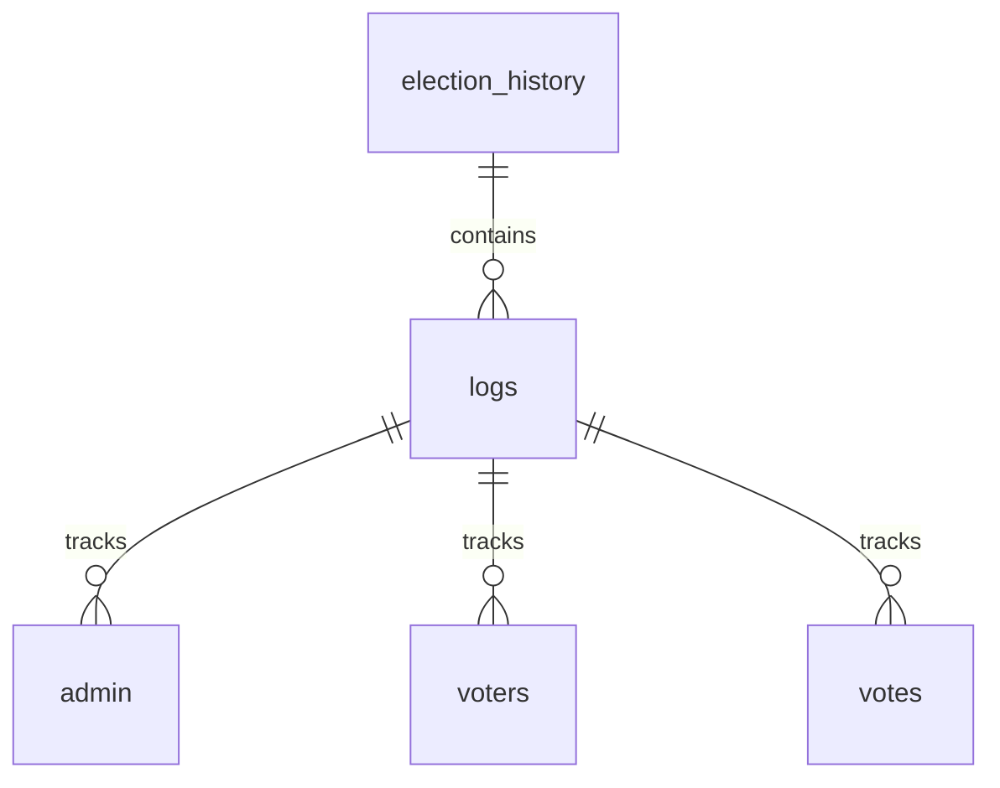
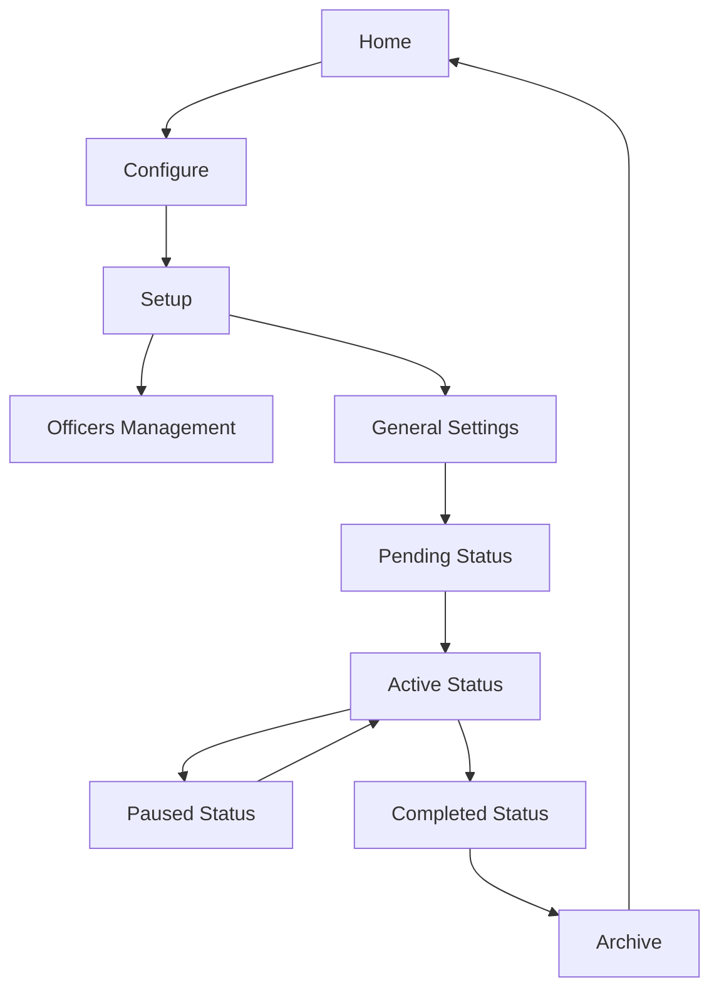

# System Patterns

## Architecture Overview

### 1. Core Components


### 2. Class Structure


## Design Patterns

### 1. Singleton Pattern
- Used in Database class
- Ensures single database connection
- Manages connection lifecycle
- Example: `Database::getInstance()`

### 2. Factory Pattern
- Used in mailer configuration
- Creates appropriate mail transport
- Handles different mail providers
- Example: `OTPMailer::createMailer()`

### 3. Repository Pattern
- Separates data access logic
- Encapsulates database operations
- Provides clean interfaces
- Example: Vote and Election classes

### 4. Observer Pattern
- Used in logging system
- Tracks system events
- Maintains audit trail
- Example: `Logger::logAction()`

## Data Flow

### 1. Voting Process


### 2. Authentication Flow


## Security Implementation

### 1. Authentication
- Two-factor authentication
- Session management
- IP tracking
- Automatic timeouts
- Password hashing (bcrypt)

### 2. Vote Security
- Transactional processing
- Vote encryption
- One-time enforcement
- Receipt generation
- Audit logging

### 3. Data Protection
- Input validation
- SQL injection prevention
- XSS protection
- CSRF tokens
- Data encryption

## Database Schema

### 1. Core Tables


### 2. Audit Tables


## Component Relationships

### 1. Frontend Components
- Bootstrap 3 framework
- jQuery for DOM manipulation
- Chart.js for analytics
- DataTables for data display
- SweetAlert2 for notifications

### 2. Backend Components
- PHP core classes
- MySQL database
- PHPMailer integration
- Session management
- Error handling

## Error Handling

### 1. Exception Hierarchy
- Database exceptions
- Authentication exceptions
- Vote processing exceptions
- Mail system exceptions
- Validation exceptions

### 2. Recovery Procedures
- Transaction rollback
- Session cleanup
- Error logging
- User notification
- System state recovery

## Performance Optimization

### 1. Database
- Indexed key fields
- Optimized queries
- Connection pooling
- Transaction management
- Cache utilization

### 2. Application
- Session management
- Resource cleanup
- Memory optimization
- Response caching
- Load balancing ready

## Election Setup Workflow

### 1. Core Flow Design



### 2. Status Transition Rules

```
Status Flow:
setup → pending → active → paused → completed
               ↑    ↓
               └────┘
```

#### Valid Transitions
- `setup` → `pending`: Initial configuration complete
- `pending` → `active`: Ready to start voting
- `active` → `paused`: Temporary halt
- `active`/`paused` → `completed`: End election
- `completed` → `setup`: Start new election

### 3. Setup Phase Structure

```
Setup Phase
├── General Settings
│   ├── Election Name
│   └── End Time & Date
├── Election Officers
│   ├── Add Officers
│   ├── Edit Officers
│   └── Delete Officers
└── Prerequisites Check
    └── Validate all required settings
```

### 4. Access Control Patterns

#### Role-Based Access Control (RBAC)

1. **Role Hierarchy**
   - Electoral Head: Full system access
   - Officers: Status-dependent access
   - Voters: Limited access to voting interface

2. **Status-Based Restrictions**
   - Setup Phase: Head only
   - Completed Phase: Head only
   - Active/Pending/Paused: Both Head and Officers

3. **Implementation Layers**
   ```mermaid
   flowchart TD
       A[Login Check] --> B[Role Check]
       B --> C[Status Check]
       C --> D[Page Access]
   ```

4. **Access Control Points**
   - Login authentication
   - Session validation
   - Page-level restrictions
   - Action-level permissions

5. **Officer Access Rules**
   - No access during setup phase
   - No access after completion
   - Full access during active phases
   - Automatic session termination on status change

### Implementation Details
1. **Login Layer**
   - Checks credentials
   - Verifies role permissions
   - Validates election status
   - Sets appropriate session data

2. **Global Check Layer**
   - Continuous status monitoring
   - Session management
   - Automatic logout on status change
   - Clear error messaging

3. **Error Handling**
   - Descriptive error messages
   - Proper redirection
   - Session cleanup
   - Audit logging

### 5. Validation Patterns

#### Status Transitions
- Validates current to new status path
- Checks prerequisites for each status
- Enforces time-based constraints
- Prevents invalid state changes

#### Data Validation
- Required field validation
- End time must be future date
- Officer data validation
- Configuration completeness check

## Current Implementation Analysis

### 1. Strengths
- Clear status progression
- Strong access controls
- Well-defined validation rules
- Structured configuration flow
- Audit logging system

### 2. Limitations

#### Workflow Issues
- No setup progress tracking
- No partial save functionality
- Limited validation feedback
- Missing setup checklist
- Rigid status transitions

#### Interface Issues
- Limited user guidance
- No visual progress indicators
- Unclear prerequisite requirements
- Basic error messaging
- Limited mobile responsiveness

#### Technical Issues
- Direct SQL in view layer
- Inconsistent error handling
- Missing input sanitization
- Potential race conditions
- Limited state rollback

### 3. Improvement Opportunities

#### Workflow Enhancements
- Add setup progress indicator
- Implement setup checklist
- Add validation feedback
- Enhance error recovery
- Improve user guidance

#### Technical Improvements
- Implement state management
- Add rollback mechanisms
- Enhance error handling
- Improve data validation
- Add concurrent access handling

#### Interface Upgrades
- Add progress visualization
- Enhance form validation
- Improve error messages
- Add help tooltips
- Mobile-responsive design

## Security Patterns

### 1. Authentication
- Session-based authentication
- Role verification on each request
- Automatic session timeout
- Secure password handling

### 2. Authorization
- Role-based access control
- Status-based restrictions
- Action logging
- Audit trail maintenance

### 3. Data Protection
- Input validation
- SQL injection prevention
- XSS protection
- CSRF protection

## Error Handling Patterns

### 1. User Errors
- Form validation feedback
- Clear error messages
- Recovery suggestions
- Status preservation

### 2. System Errors
- Exception handling
- Error logging
- Graceful degradation
- State recovery

## Data Management Patterns

### 1. State Management
- Status tracking
- Change logging
- Audit trail
- Version control

### 2. Data Validation
- Input sanitization
- Type checking
- Constraint validation
- Relationship verification

### Election Reset Pattern
- **Pre-reset Validation**
  - Ensures election is archived before reset
  - Validates current state
  - Generates new control number

- **Reset Sequence**
  1. Archive current election data
  2. Archive and reset logs
  3. Truncate election-related tables
  4. Remove officer accounts
  5. Reset election status
  6. Initialize new election state

### Archival Pattern
- **Log Archival**
  - Preserves administrative audit trail
  - Maintains voter privacy
  - Structured by election control number
  - Clear separation between active and archived data

- **Election Data Archival**
  - Complete election snapshot
  - PDF generation for permanent records
  - Organized directory structure
  - Control number based organization

### Data Privacy Pattern
- **Voter Anonymity**
  - Voter logs archived but never exposed
  - Separate storage for sensitive data
  - Clean slate for each new election
  - Historical data preserved but protected

## Future Enhancement Patterns

### 1. Workflow Improvements
- Progress tracking
- State preservation
- Validation enhancement
- User guidance

### 2. Interface Enhancements
- Mobile responsiveness
- Visual feedback
- Help system
- Accessibility

### 3. Technical Upgrades
- Code optimization
- Security hardening
- Performance improvement
- Maintainability enhancement

## Controller Patterns

### API Controller Standards
- All API controllers follow a consistent pattern:
  1. Required class imports at the top
  2. JSON content type header
  3. Request method validation
  4. Input validation and sanitization
  5. Business logic execution
  6. Standardized JSON response format
  7. Proper error handling with HTTP status codes

### Input Handling
- POST data accessed via `$_POST` with null coalescing operator (`??`)
- All input strings trimmed using `trim()`
- Empty checks performed before processing
- Input validation specific to the data type

### Error Handling
- Try-catch blocks for all operations
- Exceptions used for both system and validation errors
- HTTP status codes:
  - 200: Successful operations
  - 400: Client errors (validation, bad request)
  - 401: Unauthorized
  - 403: Forbidden
  - 500: Server errors
- JSON error response format:
  ```json
  {
    "status": "error",
    "message": "Specific error message"
  }
  ```

### Success Response Format
- Consistent JSON structure:
  ```json
  {
    "status": "success",
    "message": "Operation successful message",
    "data": {} // Optional data payload
  }
  ```

### Security Patterns
- Request method validation
- Input sanitization
- Proper error message handling (no system details exposed)
- Session validation where required
- CSRF protection implementation

### Database Operations
- Database connections handled through singleton pattern
- Prepared statements for all SQL queries
- Transaction management for complex operations
- Error handling for database operations

### Logging
- Activity logging for important operations
- Error logging for debugging
- Audit trail maintenance
- User action tracking

# Database Access Patterns

## Connection Management
- Database connections are managed through the `Database` singleton class
- All database operations should use `Database::getInstance()` to get the connection
- Direct connection access through model classes is not allowed
- Model classes should use the Database instance for queries

## Implementation Pattern
```php
// Correct pattern:
$db = Database::getInstance();
$stmt = $db->prepare($sql);

// Incorrect pattern (do not use):
$conn = $model->getConnection();
```

## Error Handling
- Database errors should be caught and thrown with descriptive messages
- Use `$db->getError()` to get detailed error information
- Always check affected rows for update/insert operations

## Connection Lifecycle
- Connections are automatically managed by the Database class
- No manual connection management required in controllers
- Connection is shared across the application
- Automatic cleanup handled by Database class destructor

## Current Implementation Analysis

### 1. Strengths
- Clear status progression
- Strong access controls
- Well-defined validation rules
- Structured configuration flow
- Audit logging system

### 2. Limitations

#### Workflow Issues
- No setup progress tracking
- No partial save functionality
- Limited validation feedback
- Missing setup checklist
- Rigid status transitions

#### Interface Issues
- Limited user guidance
- No visual progress indicators
- Unclear prerequisite requirements
- Basic error messaging
- Limited mobile responsiveness

#### Technical Issues
- Direct SQL in view layer
- Inconsistent error handling
- Missing input sanitization
- Potential race conditions
- Limited state rollback

### 3. Improvement Opportunities

#### Workflow Enhancements
- Add setup progress indicator
- Implement setup checklist
- Add validation feedback
- Enhance error recovery
- Improve user guidance

#### Technical Improvements
- Implement state management
- Add rollback mechanisms
- Enhance error handling
- Improve data validation
- Add concurrent access handling

#### Interface Upgrades
- Add progress visualization
- Enhance form validation
- Improve error messages
- Add help tooltips
- Mobile-responsive design

## Security Patterns

### 1. Authentication
- Session-based authentication
- Role verification on each request
- Automatic session timeout
- Secure password handling

### 2. Authorization
- Role-based access control
- Status-based restrictions
- Action logging
- Audit trail maintenance

### 3. Data Protection
- Input validation
- SQL injection prevention
- XSS protection
- CSRF protection

## Error Handling Patterns

### 1. User Errors
- Form validation feedback
- Clear error messages
- Recovery suggestions
- Status preservation

### 2. System Errors
- Exception handling
- Error logging
- Graceful degradation
- State recovery

## Data Management Patterns

### 1. State Management
- Status tracking
- Change logging
- Audit trail
- Version control

### 2. Data Validation
- Input sanitization
- Type checking
- Constraint validation
- Relationship verification

### Election Reset Pattern
- **Pre-reset Validation**
  - Ensures election is archived before reset
  - Validates current state
  - Generates new control number

- **Reset Sequence**
  1. Archive current election data
  2. Archive and reset logs
  3. Truncate election-related tables
  4. Remove officer accounts
  5. Reset election status
  6. Initialize new election state

### Archival Pattern
- **Log Archival**
  - Preserves administrative audit trail
  - Maintains voter privacy
  - Structured by election control number
  - Clear separation between active and archived data

- **Election Data Archival**
  - Complete election snapshot
  - PDF generation for permanent records
  - Organized directory structure
  - Control number based organization

### Data Privacy Pattern
- **Voter Anonymity**
  - Voter logs archived but never exposed
  - Separate storage for sensitive data
  - Clean slate for each new election
  - Historical data preserved but protected

## Future Enhancement Patterns

### 1. Workflow Improvements
- Progress tracking
- State preservation
- Validation enhancement
- User guidance

### 2. Interface Enhancements
- Mobile responsiveness
- Visual feedback
- Help system
- Accessibility

### 3. Technical Upgrades
- Code optimization
- Security hardening
- Performance improvement
- Maintainability enhancement

## Controller Patterns

### Setup Phase Controllers
1. Access Control Pattern
   ```php
   // Check admin status and role
   if (!$admin->isLoggedIn() || !$admin->isElectoralHead()) {
       http_response_code(403);
       exit(json_encode(['error' => 'Access denied']));
   }
   ```

2. Status Validation Pattern
   ```php
   // Verify current election status
   if ($election->getStatus() !== 'setup') {
       http_response_code(400);
       exit(json_encode(['error' => 'Invalid election status']));
   }
   ```

3. Error Handling Pattern
   ```php
   try {
       // Operation logic
   } catch (Exception $e) {
       http_response_code(500);
       exit(json_encode(['error' => $e->getMessage()]));
   }
   ```

4. Response Pattern
   ```php
   http_response_code(200);
   exit(json_encode([
       'success' => true,
       'message' => 'Operation completed successfully'
   ]));
   ```

### Controller Implementation Rules
1. All controllers must:
   - Implement proper access control
   - Validate current system state
   - Use appropriate HTTP status codes
   - Return JSON responses
   - Log significant actions
   - Use prepared statements for SQL

2. Error Handling:
   - 400 for invalid requests
   - 403 for unauthorized access
   - 500 for server errors
   - Include descriptive messages

3. Success Responses:
   - 200 for successful operations
   - Include success flag
   - Provide relevant data
   - Add operation details

### UI Components

#### Officer Management Modals
The system uses Bootstrap modals for officer management operations:

1. Add Officer Modal (`#addnew`)
   - Form fields: firstname, lastname, username, gender
   - Auto-generated secure password
   - Client-side validation on required fields
   - Bootstrap form styling

2. Edit Officer Modal (`#edit`)
   - Pre-populated form fields
   - Optional password change
   - Hidden ID field for officer identification
   - Maintains consistent styling with add modal

3. Delete Officer Modal (`#delete`)
   - Confirmation dialog with officer name
   - Hidden fields for ID and action
   - Security measures through POST method

Integration Pattern:
- Modals included via PHP include statements
- Consistent form structure across operations
- Standardized button styling and positioning
- Responsive design for all screen sizes

Security Considerations:
- Form validation on both client and server side
- Password generation follows security best practices
- CSRF protection through hidden tokens
- Secure form submissions via POST 

## Officer Password Email Pattern

- When an officer is created, if no password is provided, the system generates a random password (8 hex characters).
- If the officer's email is provided, the system sends the credentials (username and password) to the officer's email using the OfficerMailer class.
- OfficerMailer uses PHPMailer and a styled HTML template, advising the officer to change their password after login.
- This pattern is implemented in OfficerController.php and is part of the officer creation flow. 

## Email Templates

### Design Patterns
The system uses consistent email template patterns across different types of communications:

1. **Visual Hierarchy**
   - Header with system branding (green background)
   - Content section with light background
   - Important information highlighted in larger font
   - Footer with copyright and automated message notice

2. **Security Communications**
   - Credentials displayed prominently in centered boxes
   - Security warnings highlighted with distinct styling
   - Clear instructions for required actions
   - Important security notes in dedicated sections

3. **Styling Standards**
   - Font: Arial, sans-serif for consistency
   - Color scheme: 
     - Primary: #1d7c39 (green)
     - Warning: #d9534f (red)
     - Security notes: #fff3cd (light yellow)
   - Responsive design with max-width container
   - Consistent spacing and padding

4. **Template Components**
   - Header section with system name
   - Greeting with recipient name
   - Main content area with key information
   - Warning/security sections where applicable
   - Footer with copyright and system information

### Implementation
- Base styling shared between templates
- Responsive design principles
- Mobile-friendly layout
- Consistent branding elements
- Clear typography hierarchy 

## Authentication System

### Login Flow
1. User submits credentials
2. Admin->login() method:
   - Validates credentials
   - Checks user role and permissions
   - Verifies election status for officers
   - Sets appropriate error messages
3. Session handling:
   - Errors stored in session via CustomSessionHandler
   - Success/failure status preserved through redirects
4. UI feedback:
   - Bootstrap alerts for error/success messages
   - Support for both single and multiple error messages
   - HTML escaping for security

### Error Handling Pattern
1. Exception-based error handling in core methods
2. Session-based error message storage
3. Flexible error message format (string or array)
4. Clear error messages after display
5. HTML escaping for XSS prevention

### Access Control
1. Role-based access (head vs officer)
2. Election status checks for officer access
3. Clear error messages for access denial
4. Session-based authentication state

## Database Patterns
- Prepared statements for all queries
- Transaction support for critical operations
- Error logging for database operations
- Singleton pattern for database connections

## Session Management
1. CustomSessionHandler implementation
2. Consistent session state management
3. Session cleanup after message display
4. Session security measures

## UI Components
1. Bootstrap-based alert system
2. Consistent error message styling
3. Responsive design patterns
4. User feedback components

## Logging System
1. Debug logging for authentication
2. Error logging for system issues
3. Activity logging for admin actions
4. Structured log format

## Security Patterns
1. Password hashing with bcrypt
2. Prepared statements for SQL
3. HTML escaping for output
4. Session-based authentication
5. Role-based access control 

## UI Patterns

### Form Submission Loading States
```javascript
// Standard loading state implementation
function handleFormSubmission(form) {
    // 1. Store original button state
    const submitBtn = form.find('button[type="submit"]');
    const originalContent = submitBtn.html();
    
    // 2. Show loading state
    submitBtn.prop('disabled', true)
            .html('<i class="fa fa-spinner fa-spin"></i> Saving...');
    
    // 3. Ajax submission
    $.ajax({
        // ... ajax configuration ...
        complete: function() {
            // 4. Restore button state
            submitBtn.prop('disabled', false)
                    .html(originalContent);
        }
    });
}
```

### Loading State Pattern
- **Button State Management**
  - Disable button during submission
  - Show loading spinner
  - Restore original state after completion
- **Visual Feedback**
  - Use Font Awesome spinner icon
  - Include action text ("Saving...")
  - Consistent styling across forms
- **Error Handling**
  - Show error messages via SweetAlert
  - Restore button state on error
  - Prevent form resubmission

## Directory Structure
```
e-halal/
├── administrator/
│   ├── classes/
│   │   ├── Admin.php
│   │   ├── AdminOTPMailer.php
│   │   ├── View.php
│   │   └── ...
│   ├── pages/
│   │   ├── auth/
│   │   │   └── otp_verify.php
│   │   └── ...
│   └── index.php
├── classes/
│   ├── Database.php
│   ├── CustomSessionHandler.php
│   └── ...
└── ...
```

## Authentication Flow
1. Initial Login (`administrator/index.php`)
   - Handles basic credential verification
   - For head admin, initiates OTP flow
   - For officers, completes login directly

2. OTP Verification (`administrator/pages/auth/otp_verify.php`)
   - Handles OTP validation for head admin
   - Manages OTP resending and expiry
   - Completes login after successful verification

3. Session Management
   - Uses CustomSessionHandler for all session operations
   - Maintains temporary session during OTP flow
   - Clears session appropriately on completion/failure

## Code Organization Patterns

### Authentication
- Authentication logic separated into dedicated directory (`pages/auth/`)
- OTP handling isolated in `AdminOTPMailer` class
- Clear separation between initial login and OTP verification

### Class Structure
1. Admin Class
   - Core admin functionality
   - Role-based access control
   - Login and session management

2. AdminOTPMailer Class
   - OTP generation and validation
   - Email sending functionality
   - Rate limiting and attempt tracking

3. View Class
   - Consistent UI rendering
   - Header and script management
   - Alert and message handling

## Database Patterns

### Admin OTP Table
```sql
admin_otp_requests
├── id (PK)
├── email (FK -> admin.email)
├── otp
├── attempts
├── created_at
└── expires_at
```

### Security Measures
1. Rate Limiting
   - Maximum 5 OTP requests per hour
   - Automatic cleanup of expired OTPs

2. Attempt Tracking
   - Maximum 5 validation attempts per OTP
   - Automatic invalidation after max attempts

## Error Handling
1. Structured error responses
   - JSON format for AJAX requests
   - Session-based for redirects

2. Validation checks
   - Role verification
   - OTP expiry validation
   - Attempt limit tracking

## UI/UX Patterns
1. Loading States
   - Spinner animations
   - Disabled states during operations

2. Error Display
   - Consistent alert styling
   - Clear error messages

3. Success Feedback
   - Success overlay
   - Animated transitions

## Security Patterns
1. Access Control
   - Role-based restrictions
   - Session validation

2. OTP Security
   - Time-limited codes
   - Rate limiting
   - Attempt tracking

3. Data Protection
   - Email masking
   - Secure session handling
   - Password hashing

## Authentication Flow
1. Admin Login Process
   ```mermaid
   flowchart TD
       Start[Login Form] --> Validate[Validate Credentials]
       Validate --> Role{Check Role}
       Role -->|Head Admin| OTP[Generate & Send OTP]
       Role -->|Regular Admin| Direct[Direct Login]
       OTP --> Verify[Verify OTP]
       Verify -->|Success| Success[Login Success]
       Verify -->|Failure| Retry[Retry/Lock]
       Direct --> Success
   ```

2. Session Management
   ```mermaid
   flowchart TD
       Start[Session Start] --> Handler[CustomSessionHandler]
       Handler --> Set[Set Session Data]
       Set --> Get[Get Session Data]
       Get --> Clear[Clear Session Data]
       Clear --> End[Session End]
   ```

## Authentication Patterns
1. OTP Verification
   - Maximum 5 attempts per email
   - Rate limiting with cooldown period
   - Email masking for security
   - Secure session storage of temp data

2. Session Handling
   - CustomSessionHandler for all operations
   - Consistent method naming (setSession, getSession)
   - Session cleanup after use
   - Error message management

3. Error Handling
   - Try-catch blocks for critical operations
   - Consistent error message format
   - Support for both single and multiple errors
   - Clear session after display

## Security Patterns
1. Password Management
   - Bcrypt hashing for passwords
   - Secure password validation
   - No plain text storage

2. Database Access
   - Prepared statements for all queries
   - Parameter binding for security
   - Error logging for failures
   - Connection management

3. Input/Output
   - HTML escaping for all output
   - Input validation and sanitization
   - CSRF protection
   - XSS prevention

## Component Relationships
1. Admin Authentication
   ```mermaid
   flowchart TD
       Admin[Admin Class] --> Session[CustomSessionHandler]
       Admin --> OTP[AdminOTPMailer]
       OTP --> Email[Email Service]
       Session --> Storage[Session Storage]
   ```

2. Error Management
   ```mermaid
   flowchart TD
       Handler[Error Handler] --> Session[Session Storage]
       Session --> Display[Display Layer]
       Display --> Clear[Clear Messages]
   ```

## Design Patterns
1. Singleton
   - CustomSessionHandler
   - Database connection

2. Factory
   - Admin object creation
   - OTP generation

3. Observer
   - Error message handling
   - Session state changes

## Code Organization
1. Directory Structure
   ```
   administrator/
   ├── auth/
   │   ├── index.php
   │   └── otp_verify.php
   ├── classes/
   │   ├── Admin.php
   │   ├── AdminOTPMailer.php
   │   └── CustomSessionHandler.php
   └── includes/
       └── config.php
   ```

2. Class Responsibilities
   - Admin: User management and authentication
   - AdminOTPMailer: OTP operations and email
   - CustomSessionHandler: Session management

## Technical Decisions
1. Authentication
   - Two-factor auth for head admins
   - Single-factor for regular admins
   - Session-based auth state

2. Security
   - Rate limiting for OTP attempts
   - Secure session handling
   - Prepared statements

3. Error Handling
   - Consistent message format
   - Session-based storage
   - Clear after display

*Last Updated: May 1, 2025 09:30* 